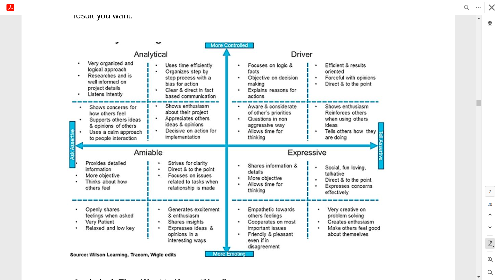

# 🔐 Azure Project: Secure File Upload System

Deploy and secure a file upload system on Azure using Blob Storage, Key Vault, NSG, and RBAC. This project showcases real-world cloud infrastructure setup with a focus on secure access, documentation, and modular deployment.

---

## 📌 Project Overview

- Deploy core infrastructure: VM, VNet, NSG, Storage
- Secure access with RBAC and Azure Key Vault
- Test manual file uploads/downloads
- Structure the project for clarity and reusability

---

## 🛠️ Tech Stack

- Azure CLI & Portal
- Azure Blob Storage
- Azure Key Vault
- NSG, VNet, IAM (RBAC)
- GitHub (VCS)

---

## ✅ Tasks Completed

### Infrastructure Setup
- [x] Created Resource Group
- [x] Deployed Linux VM (Portal)
- [x] Set up Virtual Network, Subnets, NSG

### Storage & Upload
- [x] Created Storage Account + Blob Container
- [x] Manually uploaded and downloaded test files

### Security
- [x] Created Key Vault and added secret
- [x] Assigned RBAC roles (Reader/Contributor)
- [x] Restricted blob access using IAM + KV


---

## 📁 Project Structure

```plaintext
secure-file-upload/
├── README.md
├── infra/
│   ├── notes/
│   │   ├── linux-vm.md
│   │   ├── vnet-nsg.md
│   │   ├── storage-blob.md
│   │   ├── storage-upload-download.md
│   │   ├── keyvault.md
│   │   └── rbac.md
│   └── screenshots/
```


---

## 🗺️ Architecture Diagram



--- 
## 📸 Screenshots

All screenshots are located in [`infra/screenshots/`](infra/screenshots/), including:

- 
- 
- NSG rules  
- Blob container + uploads  
- Key Vault secret  
- RBAC user role config

---

## 🧠 Learnings

- Applied secure access control using Azure RBAC + Key Vault
- Understood VNet, NSG, and IAM role configurations
- Gained practical experience with Azure CLI + Portal workflows

---

## 🧹 Cleanup
To avoid Azure charges, delete all resources:
```
az group delete --name resource-group-name --yes
```
- Replace resource-group-name with your Resource Group Name.
- --yes skips the confirmation prompt so it deletes right away.

---
## 📚 References

- [Azure Storage Blobs](https://learn.microsoft.com/en-us/azure/storage/blobs/)
- [Azure Key Vault RBAC](https://learn.microsoft.com/en-us/azure/key-vault/general/rbac-guide)
- [Secure Azure Storage Access](https://learn.microsoft.com/en-us/azure/storage/common/storage-auth)


