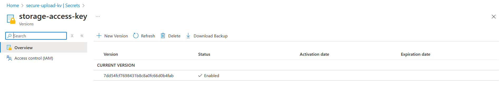

# 🔐 Azure Key Vault – Secure File Upload Project

This document contains the setup and usage of Azure Key Vault in the Secure File Upload Project to protect secrets such as storage access keys.

---

## 🏗️ 1. Key Vault Creation

| Property         | Value                 |
|------------------|------------------------|
| **Name**         | `secure-upload-kv`     |
| **Region**       | Central India          |
| **Pricing Tier** | Standard               |
| **Firewall**     | Enabled (IP-restricted)|
| **RBAC**         | Enabled                |

---

## 🔐 2. Key Vault Configuration

### ✅ Access Configuration
- **Access Control Mode**: Role-Based Access Control (RBAC)

### ✅ Firewall Rules
- Enabled firewall and added **client public IP** to the allowed list
- Verified access denial from unapproved account:
- 

---

## 🔑 3. Secret Management

### Created Secret:

---

## 🔐 Key Vault Secret: Storage Key

A dummy secret was created to simulate storing a storage account key securely.

- **Secret Name**: `storage-access-key`
- **Status**: Enabled
- **Used for**: Simulated integration with secure blob access (future Terraform)

