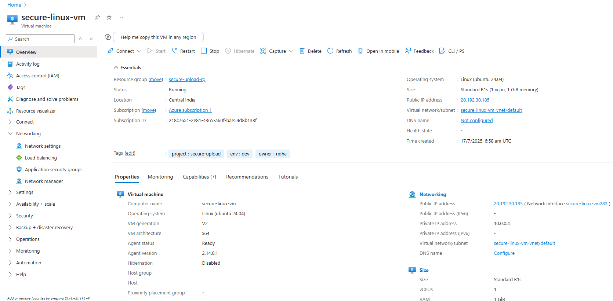
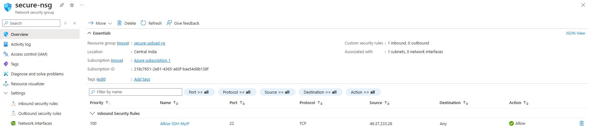
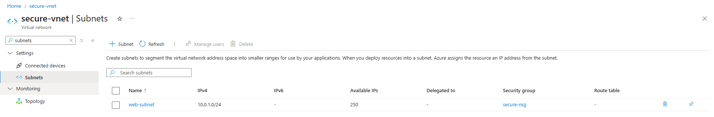
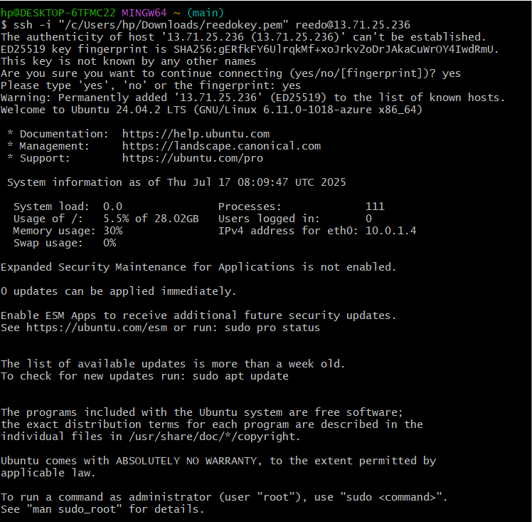

# 🐧 Linux VM Deployment – Azure Secure File Upload

This document outlines the steps to deploy a secure Linux Virtual Machine on Azure using the Portal and configure network security + SSH access. 

---

## 🧱 1. Resource Group

- **Name**: `secure-upload-rg`
- Created in **Central India** 

---

## 💻 2. Virtual Machine Configuration

| Property             | Value                    |
|----------------------|--------------------------|
| **VM Name**          | `secure-linux-vm`        |
| **Image**            | Ubuntu Server 24.04 LTS  |
| **Region**           | Central India            |
| **Size**             | Standard B1s             |
| **Auth**             | SSH Public Key (Ed25519) |
| **Username**         | `reedo`                  |
| **Key Name**         | `reedokey.pem`           |
| **Public IP**        | Assigned                 |



---

## 🌐 3. Network Configuration

| Component   | Name                |
|-------------|---------------------|
| VNet        | `secure-vnet`       |
| Subnet      | `web-subnet`        |
| NSG         | `secure-nsg`        |
| NSG Rule    | `Allow-SSH-MyIP`    |
| Source      | Public IP (`x.x.x.x`) |
| Port        | TCP 22              |
| Priority    | 100                 |
| Action      | Allow               |

- NSG is associated with the `web-subnet`
- Inbound rule only allows SSH (port 22) from **your public IP**
- This ensures the VM is **not open to the public** and reduces unauthorized access.




---
## 🔐 SSH Key & Access

- SSH key generated in Ed25519 format (`reedokey.pem`)
- Key is stored on the local machine
- SSH command used:

```bash
ssh -i "path/to/reedokey.pem" reedo@<vm-public-ip>
```

Successfully logged into the VM:




