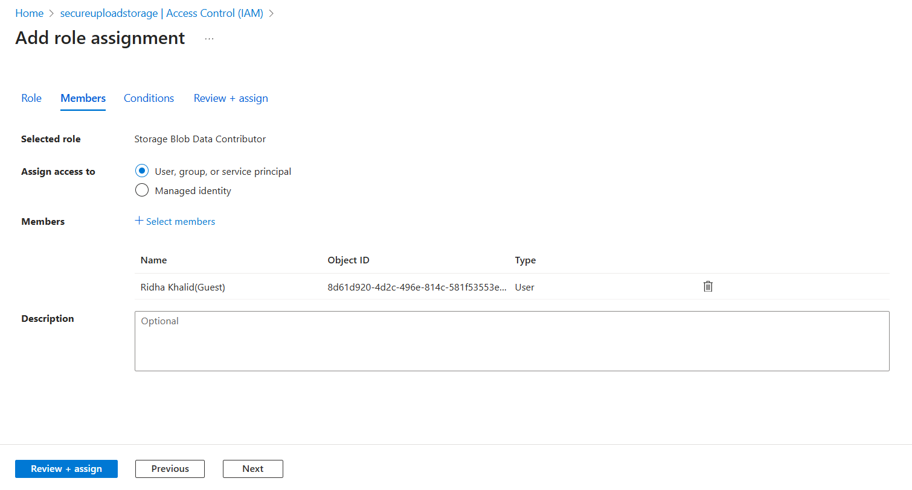
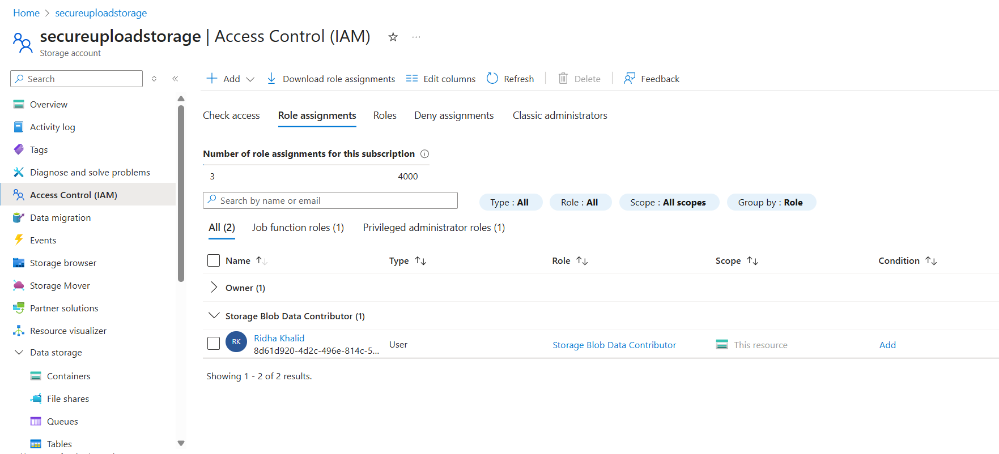

# 🔒 RBAC (Role-Based Access Control) – Azure Secure File Upload

This document contains the role assignment process to restrict and manage access to Azure resources like Storage and Key Vault using Azure RBAC (IAM).

---

### Why RBAC?

Azure RBAC allows fine-grained access control to Azure resources. Instead of sharing access keys, users are granted *just enough* access based on their role, improving security and auditability.

---

## 📦 Storage Access: Blob Data Contributor

We assigned the `Storage Blob Data Contributor` role to our user on the **Storage Account** so they can upload/download files but **not manage the account itself**.

| Setting        | Value                         |
|----------------|-------------------------------|
| **Resource**   | `secureuploadstorage`         |
| **Role**       | `Storage Blob Data Contributor` |
| **Assigned To**| `Ridha Khalid`                |
| **Scope**      | This Resource                 |

---

