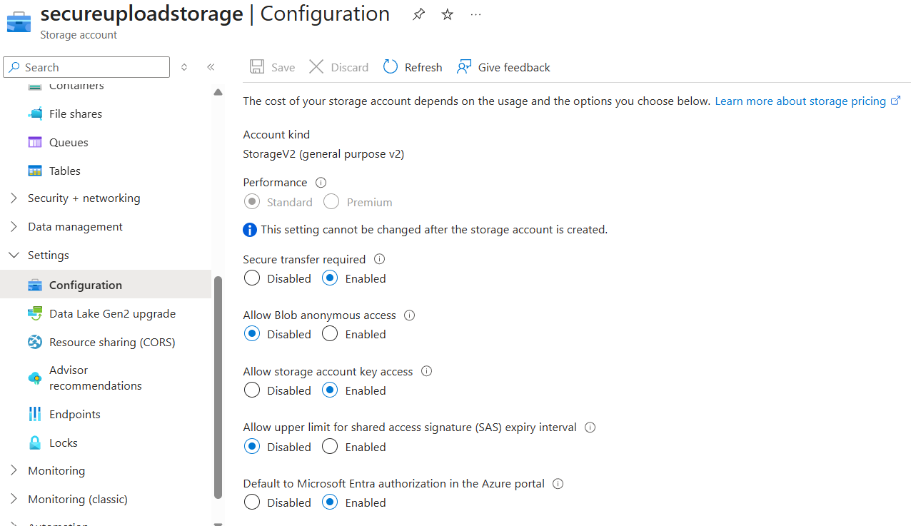

# 📦 Azure Storage + Blob + Key Vault – Secure File Upload Project

This document covers the configuration of Azure Storage, Blob container, file upload/download, and securing access via Azure Key Vault.

---

## 🔐 1. Storage Account Overview

---

## 📁 2. Blob Container Creation

- Container Name: `uploads`
- Public access level: **Private (no anonymous access)**

---

## 📤 3. File Upload & Download

Uploaded a  inside the blob container.

Verified the uploaded file by downloading it back.

---

# 🔒 5. Lock Down Storage Configuration 

To enforce secure and identity-based access, the following settings were configured:

| Setting                                      | Value         |
|---------------------------------------------|---------------|
| Secure Transfer Required                     | Enabled       |
| Public Access                                | Disabled      |
| Default to Microsoft Entra Authorization     | Enabled       |

> Ensures only encrypted connections are allowed and disables anonymous access.  
> Enforces RBAC-only access in the Azure portal (no keys/SAS unless explicitly allowed).

