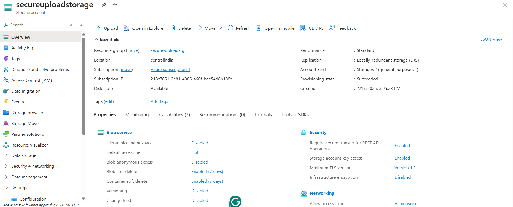
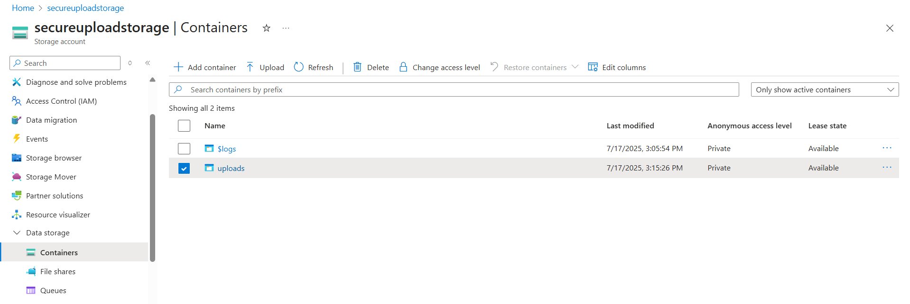
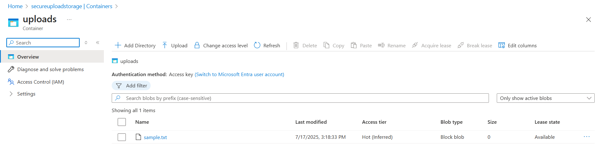
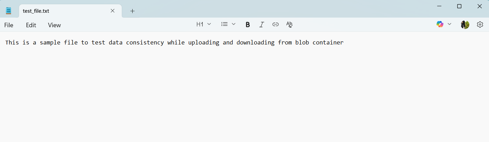
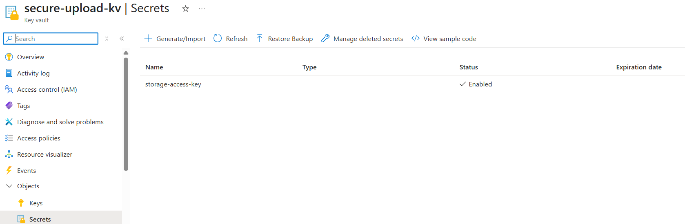

# 📦 Azure Storage + Blob + Key Vault – Secure File Upload Project

This document covers the configuration of Azure Storage, Blob container, file upload/download, and securing access via Azure Key Vault.

---

## 🔐 1. Storage Account Overview

---

## 📁 2. Blob Container Creation

- Container Name: `uploads`
- Public access level: **Private (no anonymous access)**

---

## 📤 3. File Upload & Download

Uploaded a  inside the blob container.

Verified the uploaded file by downloading it back.

---

## 🔑 4. Azure Key Vault (Securing Access)

- **Key Vault Name**: `secure-upload-kv`
- **Secret Name**: `storage-access-key`
- 📝 **Note**: The secret currently stored is a **dummy placeholder** used to simulate secure access control.  
  

